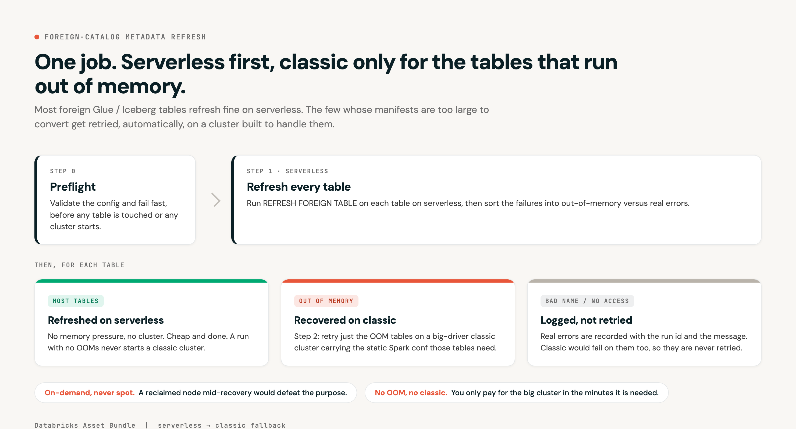
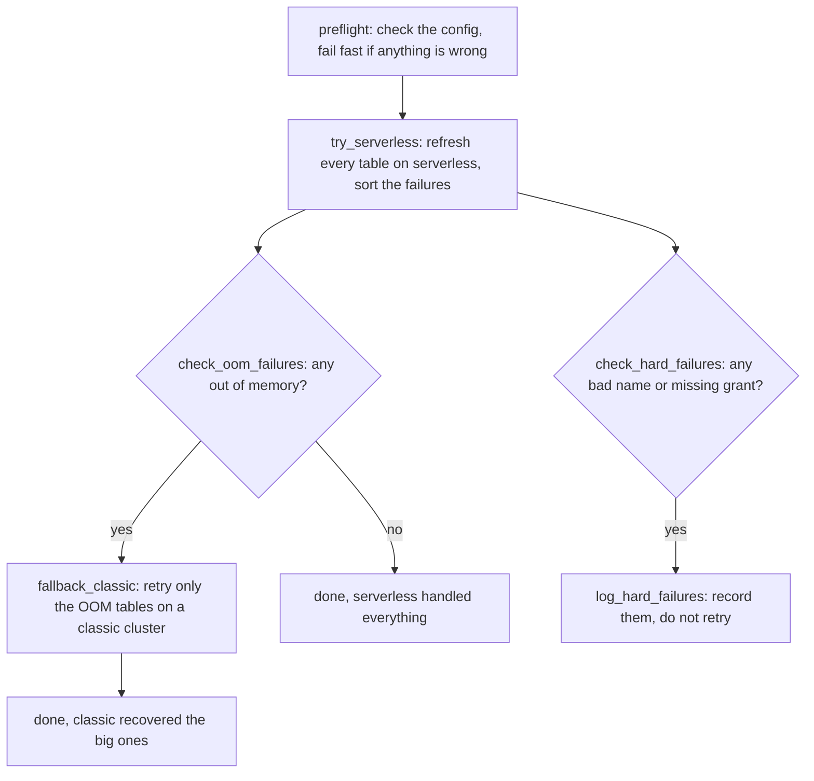

# Foreign Catalog Metadata Refresh

A Databricks Asset Bundle that keeps foreign (AWS Glue / Iceberg) tables refreshed in Unity Catalog. It runs every refresh on serverless first, and only falls back to a classic cluster for the tables that are too big to refresh on serverless without running out of memory.

Matty Serapio wrote the original bundle and the serverless-to-classic fallback pattern. I built a real Glue/Iceberg table that actually OOMs the refresh, and we tested the whole thing end to end together.

## The problem

`REFRESH FOREIGN TABLE` has to read a table's entire Iceberg manifest to convert it. On most tables that is no issue. On a handful of very large tables the manifest is big enough that the refresh runs out of memory on normal compute.

## What the bundle does

It refreshes every in-scope table on serverless, which is cheap and has no cluster to manage. If a table fails with an out-of-memory error, the job retries just that one table on a classic cluster that is sized to handle it. Tables that fail for a real reason, like a bad name or a missing grant, get logged and are not retried. Every failure is written to a Delta table so there is a record you can query later.

The point is that nobody has to refresh the big tables by hand, and you only pay for a classic cluster in the few minutes it is actually needed.

To run it in your own workspace, go straight to [Setup and run](#setup-and-run). It is about five minutes: point it at your tables and your workspace, set a log table, confirm your federation, then deploy.

## How it works

<p align="center">
  
</p>

Here is the job graph, which is what you see under the Graph tab on the job itself:



The classic cluster only starts when a table actually OOMs. A run where nothing OOMs never starts a classic cluster, so it costs nothing extra.

## Setup and run

About five minutes. Three things to fill in, two to confirm, then deploy:

- [ ] 1. Point it at your tables (`dab/src/scope_tables.py`)
- [ ] 2. Point it at your workspace (`dab/databricks.yml` host)
- [ ] 3. Set or disable the failure log (`dab/databricks.yml`)
- [ ] 4. Confirm your foreign catalog and tables already exist
- [ ] 5. If you expect OOMs, confirm classic compute is available

Every spot you need to change is a placeholder shown below. If you miss one, the preflight task stops the run with a plain-English message telling you exactly what to fix, before any table is touched.

### 1. Your tables

The scope list is git-ignored, so a clone does not include it. Copy the example:

```bash
cp dab/src/scope_tables.example.py dab/src/scope_tables.py
```

Then open `dab/src/scope_tables.py` and set `SCOPE_TABLES` to your fully qualified foreign-catalog tables:

```python
SCOPE_TABLES = [
    "my_catalog.my_schema.orders",
    "my_catalog.my_schema.events",
]
```

### 2. Your workspace

In `dab/databricks.yml`, find the `dev` target and replace the host placeholder:

```yaml
# you will see this
host: https://<your-workspace>.cloud.databricks.com
# change it to your workspace, for example
host: https://dbc-1234abcd5678.cloud.databricks.com
```

Deploy with a Databricks CLI profile that authenticates to that same workspace.

### 3. Your failure log (or turn it off)

In the same `dev` target, under `variables`, replace the placeholder:

```yaml
# you will see this
failure_log_table: "<catalog>.<schema>.metadata_refresh_failures"
# change it to a catalog.schema you can write to, for example
failure_log_table: "main.default.metadata_refresh_failures"
# or set it to "" to turn the durable log off
```

The catalog and schema have to exist already; the bundle creates the table, not the schema.

### 4. Confirm the federation already exists

The bundle runs `REFRESH FOREIGN TABLE`; it does not create the foreign catalog. The Glue / Iceberg federation and every table in your scope list have to already exist and be readable in that workspace. Setting up the federation is a one-time Unity Catalog task and is not part of this bundle.

### 5. If you expect OOMs, confirm classic compute

The fallback cluster (see [The classic recovery cluster](#the-classic-recovery-cluster) below for the exact recipe) needs `r7gd` available, on-demand quota for the worker count, and enough free subnet IP addresses (one per node). The preflight checks that the instance type exists; you confirm quota and subnet. If your subnet is tight, lower `classic_num_workers` or use a bigger instance with fewer nodes.

### Deploy and run

```bash
cd dab

# rehearse first: replays canned errors, touches no real table
databricks bundle deploy -t dev -p <your-profile>
databricks bundle run metadata_refresh -t dev -p <your-profile> --notebook-params mode=simulate

# then for real
databricks bundle run metadata_refresh -t dev -p <your-profile>
```

The job deploys paused on purpose, so it never auto-runs. Validate one manual run, then unpause it from the Jobs UI.

## The classic recovery cluster

These are the instances the fallback uses, and only for OOM recovery:

| Role | Instance | Count |
|---|---|---|
| Workers | r7gd.2xlarge | 80 |
| Driver | r7gd.12xlarge | 1 |

On-demand, DBR 17.3 LTS, with `spark.task.cpus=8` and `spark.driver.maxResultSize=0`. Those last two are static cluster settings the big tables need, and serverless cannot set them per query, which is the whole reason a classic cluster exists in this pattern.

All three numbers (worker type, driver type, worker count) are bundle variables, so you can change them to match your subnet and quota without editing any code.

## A few design choices worth knowing

Serverless runs first. Most tables refresh on serverless, with no cluster to spin up or manage.

Classic only comes up on an OOM. The big cluster starts only for the tables that ran out of memory, then it shuts down again.

On-demand, never spot. If a spot node gets reclaimed in the middle of a refresh it fails the exact recovery the cluster exists to do, so the fallback cluster is pinned to on-demand.

Everything is logged. Each failure is recorded as either retried-on-classic or skipped, along with the run id and the error message.

Fail fast on bad config. A preflight task runs first and checks the scope list, the failure log table, and the classic instance types. If something is wrong it stops the run with a plain-English message before any table is touched or any cluster starts, so a misconfigured run cannot half-run or quietly report success. It cannot see your AWS quota or subnet IPs, so those still need a manual check.

## Proven end to end

We reproduced a real OOM and watched the recovery work:

1. A foreign Iceberg table with a 9.2 GB manifest. `REFRESH FOREIGN TABLE` on serverless ran out of memory (JVM_OUT_OF_MEMORY).
2. The bundle classified it as an OOM and routed it to the classic cluster. A bad-name table got flagged and skipped. A smaller table refreshed fine on serverless.
3. The classic cluster launched and recovered the table. The run finished clean, and the table that used to OOM now reads.

One thing worth knowing: in the shared workspace we tested in, the subnet did not have enough free IPs for 80 nodes, so we proved the recovery on a single large node instead. Size the cluster to your subnet, which is why the subnet check in setup matters.

<details>
<summary>Where to see refreshes</summary>

<br>

Central, all tables, automatic, in `system.query.history`. Every `REFRESH FOREIGN TABLE` is logged with status, duration, error, and who ran it. OOMs show up as FAILED with the memory error in `error_message`. Long duration is roughly a full refresh, short is incremental.

```sql
SELECT start_time, executed_by, execution_status, total_duration_ms, error_message, statement_text
FROM   system.query.history
WHERE  statement_text ILIKE 'REFRESH FOREIGN TABLE%'
  AND  start_time >= current_date() - INTERVAL 7 DAYS
ORDER  BY start_time DESC;
```

When and who last refreshed each table, in `system.information_schema.tables`.

```sql
SELECT table_name, last_altered, last_altered_by
FROM   system.information_schema.tables
WHERE  table_catalog = 'your_foreign_catalog'
ORDER  BY last_altered DESC;
```

The Unity Catalog operation audit is in `system.access.audit`. The refresh logs there as `updateMetadataSnapshot` and `commitDeltaUniformMetadata`, which is the who-did-what level.

Exact full versus incremental file counts only show up in `DESCRIBE HISTORY <table>`.

The bundle also writes its own curated log to the `failure_log_table` you configure, with every OOM-retried or hard-skipped table tagged by run, mode, and action.

</details>

<details>
<summary>Full versus incremental refresh</summary>

<br>

A foreign Iceberg table is materialized in Databricks as a Delta CLONE, and `DESCRIBE HISTORY` shows it. The signal is the CLONE operation's `operationMetrics`:

- Full refresh: `numCopiedFiles` equals `sourceNumOfFiles`. It re-reads every manifest, which is the heavy, OOM-prone case.
- Incremental: `numCopiedFiles` is much smaller than `sourceNumOfFiles`. Only the new snapshot files are copied, which is cheap.

We verified this. The initial refresh copied 1000 of 1000 files (full). After a 50-file append, the next refresh copied only 50 of 1050 (incremental). So the OOM is specifically a full-refresh event. Tables that are maintained incrementally stay cheap.

</details>

<details>
<summary>Building the OOM test table, and Lake Formation notes</summary>

<br>

The OOM is scale-driven, not a fluke. A wide table (500 columns) times many small files times full per-column metrics times high-entropy values inflates the Iceberg manifest until the refresh cannot deserialize it in memory. You build it on EMR:

```bash
oom_demo/run_step.sh big --tbl oom_big --cols 500 --files 1000 --appends 8 --metrics full --vlen 2048
# 10 manifests, about 9.2 GB, 8000 files
```

Lake Formation notes for strict-mode accounts:

- Even a full-admin user cannot grant on an Iceberg-created database. The grants have to come from the table's creator role (see `oom_demo/fix_lf_via_emr.sh`).
- A foreign catalog needs a storage location: the `authorized_paths` option, an external location over the data path, and a writable `storage_root` (the uniform Delta log materializes there).

The `oom_demo/` scripts are the test rig we used to manufacture an OOM. They are not needed to run the bundle, and they ship with placeholder account ids and resource names, so swap in your own before running them.

</details>

<details>
<summary>Repo layout</summary>

<br>

```
dab/                          The Databricks Asset Bundle (this is what you deploy)
  databricks.yml                targets and variables (dev and prod carry the 80-node recipe)
  resources/...job.yml          the job: preflight, try_serverless, then fallback_classic on an OOM
  src/                          00_preflight.py, 01_try_serverless.py, 02_fallback_classic.py, 03_log_hard_failures.py
                                scope_tables.example.py (copy to scope_tables.py with your tables)
oom_demo/                     test rig to build the Glue/Iceberg OOM table and wire federation (not needed to run the bundle)
```

`scope_tables.py` (your real table list) and `aws_credentials.txt` are git-ignored, so they never leave your machine. Copy `scope_tables.example.py` to get started.

</details>

## Credits

Matty Serapio (https://github.com/mattserapio) wrote the original Foreign Catalog Metadata Refresh bundle and the serverless-to-classic fallback pattern. I built the real Glue/Iceberg OOM table and ran the end-to-end validation, from the serverless OOM through to the classic recovery. We wrote and tested it together.
